<p align="center">
  <h1 align="center">
    <svg xmlns="http://www.w3.org/2000/svg" width="40" height="40" viewBox="0 0 24 24" fill="none" style="vertical-align: middle; margin-right: 10px;">
      <defs>
        <linearGradient id="shieldGrad" x1="0%" y1="0%" x2="100%" y2="100%">
          <stop offset="0%" stop-color="#00f2fe" />
          <stop offset="100%" stop-color="#4facfe" />
        </linearGradient>
      </defs>
      <path d="M12 22s8-4 8-10V5l-8-3-8 3v7c0 6 8 10 8 10z" fill="url(#shieldGrad)" />
      <path d="M12 18s5-2.5 5-6.25V7.25l-5-1.88-5 1.88v4.5C7 15.5 12 18 12 18z" fill="#0f172a" opacity="0.3"/>
    </svg>TrueSentinel
  </h1>
  <p align="center">
    <strong>Full-stack ML pipeline for real-time YouTube comment sentiment analysis</strong>
  </p>
  <p align="center">
    
    
    
    
  </p>
</p>

---

TrueSentinel is not a wrapper around a pre-trained API. It's a **complete, from-scratch ML pipeline** that harvests live YouTube comments, preprocesses and labels them via NLP lexicon rules, trains both **Logistic Regression** and **SVM** classifiers with stratified cross-validation, and deploys them behind a **FastAPI** server with a glassmorphism dashboard — all without a single external ML service.

## <svg xmlns="http://www.w3.org/2000/svg" width="24" height="24" viewBox="0 0 24 24" fill="none" stroke="#38bdf8" stroke-width="2" stroke-linecap="round" stroke-linejoin="round" style="vertical-align: middle; margin-right: 8px;"><line x1="18" y1="20" x2="18" y2="10"/><line x1="12" y1="20" x2="12" y2="4"/><line x1="6" y1="20" x2="6" y2="14"/></svg> Impact Metrics

| Metric | Value |
|---|---|
| **Logistic Regression Accuracy** | Validated via 5-Fold Stratified CV (see `models/metrics.json`) |
| **SVM Accuracy** | Validated via 5-Fold Stratified CV (see `models/metrics.json`) |
| **Training Data** | Live-harvested from 6 diverse YouTube videos via Data API v3 |
| **Inference Latency** | < 50ms for 100 comments (TF-IDF vectorization + model prediction) |
| **Cumulative Tracking** | Persists total analyses, comments processed, and spam blocked across sessions |

> **Why this matters**: Every metric is computed from real evaluation — no hardcoded numbers. The training pipeline generates `models/metrics.json` with accuracy, precision, recall, F1 scores, and confusion matrices for both models using held-out test sets and 5-fold cross-validation.

```mermaid
graph LR
    A[YouTube Data API v3] -->|100 comments/video| B[Data Harvester]
    B --> C[Spam Filter<br/>URL + keyword + gibberish]
    C --> D[Lexicon Labeler<br/>Double-negative handling]
    D --> E[TF-IDF Vectorizer<br/>Unigrams + Bigrams]
    E --> F[Model Training<br/>LR + SVM]
    F --> G[Serialized .pkl Models]
    G --> H[FastAPI Server]
    H --> I[Real-time Inference<br/>+ NMF Topic Extraction]
    I --> J[Glassmorphism Dashboard<br/>Donut Chart + Comment Feed]
```

## <svg xmlns="http://www.w3.org/2000/svg" width="24" height="24" viewBox="0 0 24 24" fill="none" stroke="#38bdf8" stroke-width="2" stroke-linecap="round" stroke-linejoin="round" style="vertical-align: middle; margin-right: 8px;"><rect x="3" y="3" width="7" height="9" rx="1"/><rect x="14" y="3" width="7" height="5" rx="1"/><rect x="14" y="12" width="7" height="9" rx="1"/><rect x="3" y="16" width="7" height="5" rx="1"/><path d="M7 12v4M17 8v4M10 8h4"/></svg> Architecture



## <svg xmlns="http://www.w3.org/2000/svg" width="24" height="24" viewBox="0 0 24 24" fill="none" stroke="#38bdf8" stroke-width="2" stroke-linecap="round" stroke-linejoin="round" style="vertical-align: middle; margin-right: 8px;"><path d="M6 19L2 22l3-4M21 3a22.3 22.3 0 0 0-11.2 5.8 20.8 20.8 0 0 0-4.1 7.2M21 3a22.3 22.3 0 0 1-5.8 11.2 20.8 20.8 0 0 1-7.2 4.1M21 3L11 13M13 5L8.5 9.5M19 11l-4.5-4.5"/></svg> Features

- **From-Scratch ML Pipeline** — No pre-trained APIs. Raw comments → lexicon labels → TF-IDF features → trained classifiers.
- **Dual Model Training** — Logistic Regression + SVM with `class_weight='balanced'` for robust performance on skewed data.
- **5-Fold Stratified Cross-Validation** — Real evaluation metrics saved to `models/metrics.json`, not hardcoded.
- **Smart NLP Preprocessing** — URL stripping, double-negative handling ("not bad" → positive), bigram support.
- **Automated Spam Filtering** — Catches URLs, crypto spam, repetitive gibberish, and bot patterns.
- **NMF Topic Modeling** — Extracts 3 core discussion topics from comment text.
- **Cumulative Impact Stats** — Tracks total analyses, comments processed, and spam blocked across sessions.
- **Real-Time Dashboard** — Pure JS donut chart, animated counters, progress steps, comment filtering, toast notifications.
- **Zero Frontend Dependencies** — Canvas-rendered charts, custom animations, no Chart.js or D3.

## <svg xmlns="http://www.w3.org/2000/svg" width="24" height="24" viewBox="0 0 24 24" fill="none" stroke="#38bdf8" stroke-width="2" stroke-linecap="round" stroke-linejoin="round" style="vertical-align: middle; margin-right: 8px;"><polyline points="4 17 10 11 4 5"/><line x1="12" y1="19" x2="20" y2="19"/></svg> Quick Start

### Prerequisites
- Python 3.9+
- [YouTube Data API v3 Key](https://console.cloud.google.com/apis/library/youtube.googleapis.com)

### Setup

```bash
# Clone the repository
git clone https://github.com/Yogeshvar425/TrueSentinel.git
cd TrueSentinel

# Install dependencies
pip install -r requirements.txt

# Configure your API key
cp .env.example .env
# Edit .env and add your YOUTUBE_API_KEY
```

### Train Your Models

```bash
python train.py
```

This will:
1. Harvest ~600 live comments from 6 diverse YouTube videos
2. Filter spam and label via lexicon rules
3. Vectorize with TF-IDF (unigrams + bigrams, 3000 features)
4. Train Logistic Regression + SVM with class weight balancing
5. Evaluate with held-out test set + 5-fold stratified CV
6. Save models to `models/` and metrics to `models/metrics.json`

### Launch the Dashboard

```bash
python server.py
```

Navigate to **http://localhost:8000** — paste any YouTube URL and watch the pipeline analyze sentiment in real-time.

## <svg xmlns="http://www.w3.org/2000/svg" width="24" height="24" viewBox="0 0 24 24" fill="none" stroke="#38bdf8" stroke-width="2" stroke-linecap="round" stroke-linejoin="round" style="vertical-align: middle; margin-right: 8px;"><path d="M9.5 2A2.5 2.5 0 0 1 12 4.5v15a2.5 2.5 0 0 1-4.96-.44 2.5 2.5 0 0 1 0-3.12 3 3 0 0 1 0-3.88 2.5 2.5 0 0 1 0-3.12A2.5 2.5 0 0 1 9.5 2zM14.5 2A2.5 2.5 0 0 0 12 4.5v15a2.5 2.5 0 0 0 4.96-.44 2.5 2.5 0 0 0 0-3.12 3 3 0 0 0 0-3.88 2.5 2.5 0 0 0 0-3.12A2.5 2.5 0 0 0 14.5 2z"/></svg> How It Works

### Data Collection
Comments are fetched live from the YouTube Data API v3 (100 per video). The training set is intentionally diverse — viral videos, controversial content, music, and historic uploads.

### Labeling Strategy
Since supervised learning requires labels, TrueSentinel uses a **lexicon-based labeling** approach with 50+ sentiment keywords. It handles edge cases like:
- **Double negatives**: "not bad" → positive (not misclassified as negative)
- **Slang/informal**: "10/10", "cringe", "masterpiece"
- **Ambiguous comments**: Skipped (only strictly polar comments are labeled)

### Feature Engineering
Text is vectorized using **TF-IDF with bigrams** (`ngram_range=(1,2)`). Notably, English stop words are **not removed** — because `"not"` is a stop word, and removing it turns `"not bad"` into `"bad"`.

### Model Evaluation
Both models are evaluated with:
- **Accuracy, Precision, Recall, F1-Score** on a held-out 20% test split
- **5-Fold Stratified Cross-Validation** to estimate generalization performance
- Results saved to `models/metrics.json` — what the dashboard displays

## <svg xmlns="http://www.w3.org/2000/svg" width="24" height="24" viewBox="0 0 24 24" fill="none" stroke="#38bdf8" stroke-width="2" stroke-linecap="round" stroke-linejoin="round" style="vertical-align: middle; margin-right: 8px;"><path d="M22 19a2 2 0 0 1-2 2H4a2 2 0 0 1-2-2V5a2 2 0 0 1 2-2h5l2 3h9a2 2 0 0 1 2 2z"/></svg> Project Structure

```
TrueSentinel/
├── server.py              # FastAPI backend + API routes
├── train.py               # ML training pipeline
├── main.py                # CLI analysis tool
├── models/                # Serialized models + metrics
│   ├── logistic_model.pkl
│   ├── tfidf_vectorizer.pkl
│   ├── metrics.json       # Real evaluation metrics
│   ├── training_data.csv  # Labeled training dataset
│   └── cumulative_stats.json
├── static/                # Frontend (zero dependencies)
│   ├── index.html
│   ├── style.css
│   └── app.js
├── requirements.txt
├── .env.example
├── .gitignore
└── LICENSE
```

## <svg xmlns="http://www.w3.org/2000/svg" width="24" height="24" viewBox="0 0 24 24" fill="none" stroke="#38bdf8" stroke-width="2" stroke-linecap="round" stroke-linejoin="round" style="vertical-align: middle; margin-right: 8px;"><polygon points="12 2 2 7 12 12 22 7 12 2"/><polyline points="2 17 12 22 22 17"/><polyline points="2 12 12 17 22 12"/></svg> Tech Stack

| Layer | Technology | Purpose |
|---|---|---|
| ML Training | Scikit-Learn | Logistic Regression, SVM, TF-IDF, Cross-Validation |
| Backend | FastAPI + Uvicorn | REST API, model serving, static files |
| Data Pipeline | Google API Client, Pandas | YouTube comment harvesting, data wrangling |
| Frontend | Vanilla JS + CSS3 | Canvas donut chart, animations, glassmorphism UI |
| Deployment | Python stdlib | No Docker required (optional) |

## <svg xmlns="http://www.w3.org/2000/svg" width="24" height="24" viewBox="0 0 24 24" fill="none" stroke="#38bdf8" stroke-width="2" stroke-linecap="round" stroke-linejoin="round" style="vertical-align: middle; margin-right: 8px;"><polyline points="22 12 18 12 15 21 9 3 6 12 2 12"/></svg> API Endpoints

| Method | Endpoint | Description |
|---|---|---|
| `POST` | `/api/analyze` | Analyze a YouTube video's comment sentiment |
| `GET` | `/api/health` | Server health, model status, training metrics, cumulative stats |

### `POST /api/analyze`

**Request:**
```json
{ "url": "https://www.youtube.com/watch?v=dQw4w9WgXcQ" }
```

**Response includes:**
- `emotions` — Sentiment distribution with counts and percentages
- `topics` — NMF-extracted discussion topics
- `training_metrics` — Real accuracy, F1, precision, recall for both models
- `cumulative_stats` — Total analyses run, comments processed, spam blocked
- `inference_time_ms` — End-to-end processing time in milliseconds

## <svg xmlns="http://www.w3.org/2000/svg" width="24" height="24" viewBox="0 0 24 24" fill="none" stroke="#eab308" stroke-width="2" stroke-linecap="round" stroke-linejoin="round" style="vertical-align: middle; margin-right: 8px;"><path d="M10.29 3.86L1.82 18a2 2 0 0 0 1.71 3h16.94a2 2 0 0 0 1.71-3L13.71 3.86a2 2 0 0 0-3.42 0z"/><line x1="12" y1="9" x2="12" y2="13"/><line x1="12" y1="17" x2="12.01" y2="17"/></svg> Known Limitations & Future Work

This project intentionally uses classical ML (not pre-trained transformers) to demonstrate building a pipeline from scratch. That comes with trade-offs:

| Limitation | Why It Happens | Proposed Fix |
|---|---|---|
| **Contextual sentiment misses** — e.g., "my crush was embarrassed" classified as positive | TF-IDF is bag-of-words; it doesn't understand word order or relationships | Fine-tune a pre-trained model (DistilBERT) that captures contextual semantics |
| **Sarcasm / irony** — "Oh great, another masterpiece" misclassified as positive | Sarcasm requires pragmatic understanding beyond word-level features | Ensemble with a sarcasm detection classifier or use transformer attention |
| **Low-confidence predictions** (~55%) on ambiguous comments | Training set is ~164 samples — insufficient for high generalization | Scale to 5,000+ labeled samples via crowd-sourcing or semi-supervised learning |
| **Binary classification only** (positive/negative) | The project scope was limited to binary sentiment | Extend to multi-class emotion detection (joy, anger, sadness, surprise) |
| **YouTube-specific vocabulary** | Training data is harvested from YouTube comments only | Diversify sources (Reddit, Twitter/X, product reviews) for domain-robust models |

> **Key takeaway**: A TF-IDF + Logistic Regression model with 164 training samples achieves ~76% accuracy on held-out data and ~65% on cross-validation. This is honest — and it's exactly why the industry moved to pre-trained transformers. The value of this project is understanding the full pipeline, not competing with GPT.

### Concrete Next Steps
1. **BERT fine-tuning** — Replace TF-IDF + LR with a fine-tuned `distilbert-base-uncased-finetuned-sst-2-english` for context-aware predictions
2. **VADER ensemble** — Combine ML predictions with VADER lexicon scores for a hybrid approach
3. **Active learning loop** — Let users flag misclassifications in the dashboard, retrain on corrected labels
4. **Confidence calibration** — Apply Platt scaling so the displayed confidence percentages are actually meaningful

## <svg xmlns="http://www.w3.org/2000/svg" width="24" height="24" viewBox="0 0 24 24" fill="none" stroke="#38bdf8" stroke-width="2" stroke-linecap="round" stroke-linejoin="round" style="vertical-align: middle; margin-right: 8px;"><path d="M14 2H6a2 2 0 0 0-2 2v16a2 2 0 0 0 2 2h12a2 2 0 0 0 2-2V8z"/><polyline points="14 2 14 8 20 8"/><line x1="16" y1="13" x2="8" y2="13"/><line x1="16" y1="17" x2="8" y2="17"/><polyline points="10 9 9 9 8 9"/></svg> License

This project is licensed under the MIT License — see the [LICENSE](LICENSE) file for details.

---

<p align="center">
  Built from scratch by <strong>V S Yogeshvar</strong><br>
  <em>No pre-trained APIs. Custom models only.</em>
</p>
